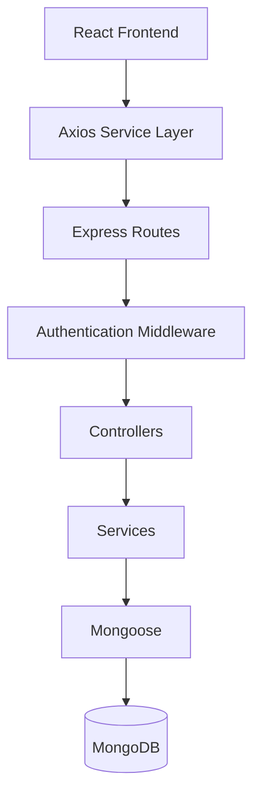

# LinkForge

LinkForge is a full-stack URL shortening and link analytics platform built with React, Express, and MongoDB.

## Architecture Overview

LinkForge is structured as a decoupled monorepo containing a frontend client and a backend API server:

```
LinkForge/
├── client/          # Frontend application (React + Vite)
└── server/          # Backend API server (Express + MongoDB)
```

### Architecture Flow



### Core Technologies
- **Frontend:** React 19, React Router v7, Axios, Vanilla CSS, `qrcode.react` (for client-side canvas-to-PNG generation)
- **Backend:** Node.js, Express, MongoDB (Mongoose), JSON Web Tokens (JWT) for authentication, `nanoid` (for short code hashes), bcrypt (for secure password hashing)

---

## Key Features

- **Create shortened URLs instantly:** Input any destination URL to generate a clean, shortened link hash.
- **Custom aliases:** Specify friendly custom URLs (valid characters: alphanumeric, hyphens, and underscores) with database collision validation.
- **Link expiration:** Set links to auto-expire after 1 Day, 7 Days, or 30 Days. Expired links trigger an HTTP `410 Gone` code and block redirection.
- **Link analytics:** Track clicks, custom/auto badges, creation dates, and last visited timestamps per link.
- **Instant search & sort:** Real-time, case-insensitive search filters. Sort links by creation date, click metrics, or alphabetically.
- **QR code generation:** Render link QR codes on-demand and download them as PNG images directly from the browser.
- **JWT authentication:** Session registration, logins, persistent state restoring via localStorage, and protected route guards.
- **Toast notifications:** Reusable animated alerts for copy events, link updates, auth success, and errors.
- **Responsive dashboard:** Optimized layout structures with keyboard support (Escape key modal closures) and focus outline indicators.

---

## REST API

### Authentication
- `POST /api/auth/register` — Register a new account
- `POST /api/auth/login` — Login to get a JWT session token

### URLs
- `POST /api/urls` — Create a shortened URL (supports optional custom alias and expiration)
- `GET /:shortCode` — Redirect from short code to destination URL (performs validation)
- `PATCH /api/urls/:id` — Update destination URL for a shortened link
- `DELETE /api/urls/:id` — Delete a shortened link

---

## Directory Structure

### Client
```
client/src/
├── components/
│   ├── common/
│   │   ├── ConfirmModal.jsx    # Delete confirmation dialog
│   │   └── QRModal.jsx         # QR code preview & download dialog
│   └── ProtectedRoute.jsx      # Auth checking route guard
├── context/
│   ├── AuthContext.jsx         # Global user session states
│   └── ToastContext.jsx        # Notification stack manager
├── pages/
│   ├── Dashboard.jsx           # Link analytics and action board
│   ├── Home.jsx                # Core shorten landing page
│   ├── Login.jsx               # Auth login screen
│   ├── Register.jsx            # Auth signup screen
│   └── NotFound.jsx            # Polished 404 handler
├── services/
│   ├── api.js                  # Axios middleware instance (adds JWT headers)
│   ├── authService.js          # Authentication endpoint wrappers
│   └── urlService.js           # Link CRUD endpoint wrappers
└── styles/                     # CSS stylesheets matching design system tokens
```

### Server
```
server/src/
├── config/
│   └── db.js                   # MongoDB connection logic
├── controllers/
│   ├── authController.js       # Register and Login business logic
│   └── urlController.js        # Link shortening and redirection controllers
├── middleware/
│   ├── authMiddleware.js       # Route protect token validation
│   └── errorHandler.js         # Unified error formatting catch block
├── models/
│   ├── User.js                 # Mongo Schema for user registrations
│   └── Url.js                  # Mongo Schema for url analytics and expiration
├── routes/
│   ├── authRoutes.js           # Auth route declarations
│   └── urlRoutes.js            # URL CRUD route declarations
└── server.js                   # Application bootstrap entry point
```

---

## Getting Started

### Prerequisites
- Node.js (v18 or higher recommended)
- npm or yarn
- MongoDB Instance (Atlas or Local)

---

### Step 1: Backend Setup

1. Navigate to the `server` directory:
   ```bash
   cd server
   ```

2. Install dependencies:
   ```bash
   npm install
   ```

3. Create a `.env` file inside the `server/` directory and configure the environment variables:
   ```env
   PORT=5001
   MONGO_URI=mongodb+srv://<username>:<password>@cluster.mongodb.net/linkforge
   JWT_SECRET=your_jwt_signing_secret_here
   ```

4. Run the server in development mode:
   ```bash
   npm run dev
   ```
   The backend will bootstrap on `http://localhost:5001`.

---

### Step 2: Frontend Setup

1. Navigate to the `client` directory:
   ```bash
   cd ../client
   ```

2. Install dependencies:
   ```bash
   npm install
   ```

3. (Optional) Create a `.env` file in the `client/` directory to customize the API URL:
   ```env
   VITE_API_URL=http://localhost:5001/api
   ```

4. Run the development build:
   ```bash
   npm run dev
   ```
   Open `http://localhost:5173` in your browser to view the application.

5. Compile production assets:
   ```bash
   npm run build
   ```
   Production-ready optimized HTML, CSS, and JS chunks will compile inside the `client/dist` folder.

---

## Future Improvements

- **Advanced analytics dashboard:** Interactive charts, geolocational traffic mapping, and referrer/user-agent stats.
- **Rate limiting:** API rate-limiting middleware to protect shortening and redirect routes from spam.
- **Docker support:** Dockerfile configurations for containerizing and deploying LinkForge services.
- **Custom domains:** Support mapping personal domains to shortened user hashes.
- **Team workspaces:** Multi-user workspaces to share, collaborate, and manage link collections.
